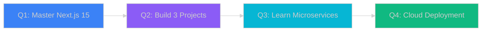

<!-- Animated Hero Section -->
<div align="center">
  
</div>

<!-- Dynamic Typing with Icons -->
<div align="center">
  
</div>

<!-- Badges Grid -->
<div align="center">
  
  
  
  
  
</div>

<br/>

<!-- Animated Divider -->


## 🌟 About Me


```typescript
interface Developer {
  name: string;
  title: string;
  location: string;
  passion: string[];
  currentMission: string;
}

const khanhhuy: Developer = {
  name: "Lê Đặng Khánh Hỷ",
  title: "Full-Stack Developer 🚀",
  location: "Ho Chi Minh City 🇻🇳",
  passion: [
    "Building beautiful UIs",
    "Writing clean code",
    "Solving complex problems",
    "Learning new technologies"
  ],
  currentMission: "Creating amazing web experiences that users love ❤️"
};

// My development philosophy
const philosophy = {
  code: "Write code that speaks for itself",
  design: "Beauty meets functionality",
  quality: "Perfection is in the details",
  growth: "Never stop learning"
};
```

### 🎯 Quick Facts

- 🔭 Currently building **E-commerce Platform** with Next.js & Spring Boot
- 🌱 Learning **System Design**, **Microservices**, and **Cloud Architecture**
- 💼 Open to **Full-Stack Developer** opportunities
- 🎨 Love creating **pixel-perfect**, **responsive** designs
- ⚡ Fun fact: Coffee ☕ + Code 💻 = Magic ✨
- 📫 Reach me: **ledangkhanhhy@gmail.com**

<br/>

<!-- Animated Divider -->


## 🛠️ Technology Arsenal

<div align="center">

### 💎 Frontend Magic

<p>
  
</p>

### ⚙️ Backend Power

<p>
  
</p>

### 🧰 DevOps & Tools

<p>
  
</p>

</div>

### 📊 Tech Proficiency

```text
Frontend Development   ████████████████████░   95%
Backend Development    ██████████████████░░░   85%
Database Management    ███████████████████░░   90%
DevOps & Deployment    ████████████░░░░░░░░░   60%
UI/UX Design          ██████████████████░░░   88%
```

<br/>

<!-- Animated Divider -->


## 📊 GitHub Analytics

<div align="center">
  
  <!-- GitHub Stats Card -->
  
  
  <!-- Top Languages -->
  

</div>

<div align="center">
  
  <!-- Streak Stats -->
  
  
  <!-- Trophy -->
  

</div>

<!-- Contribution Graph -->
<div align="center">
  
</div>

<br/>

<!-- Animated Divider -->


## 🚀 Featured Projects

<div align="center">

<table>
<tr>
<td width="50%">

### 🛒 E-Commerce Platform

<a href="https://github.com/ledangkhanhhydeptrai/ecommerce-project">
  
</a>

**Modern Online Shopping Experience**

🔹 Next.js • Spring Boot • MySQL • Redis  
🔹 Payment Integration • Admin Dashboard  
🔹 Real-time Cart • Role-Based Access

</td>
<td width="50%">

### 🔐 Auth System

<a href="https://github.com/ledangkhanhhydeptrai/auth-system">
  
</a>

**Secure Authentication Solution**

🔹 JWT • Spring Security • OAuth2  
🔹 Token Refresh • Password Reset  
🔹 Role Management • 2FA Ready

</td>
</tr>

<tr>
<td width="50%">

### 🎨 Portfolio Website

<a href="https://github.com/ledangkhanhhydeptrai/portfolio">
  
</a>

**Personal Brand Showcase**

🔹 React • TypeScript • Framer Motion  
🔹 Smooth Animations • Dark Mode  
🔹 SEO Optimized • Fully Responsive

</td>
<td width="50%">

### 📱 Social App

<a href="https://github.com/ledangkhanhhydeptrai/social-app">
  
</a>

**Connect & Share Platform**

🔹 Next.js • Prisma • PostgreSQL  
🔹 Real-time Chat • Media Upload  
🔹 Social Features • PWA Support

</td>
</tr>
</table>

</div>

<div align="center">
  <a href="https://github.com/ledangkhanhhydeptrai?tab=repositories">
    
  </a>
</div>

<br/>

<!-- Animated Divider -->


## 💼 Current Focus

<div align="center">

| Project | Status | Progress | Next Steps |
|---------|--------|----------|------------|
| 🛒 E-commerce Platform | 🟢 Active | ████████████░░░░ 75% | Payment gateway integration |
| 🔐 Authentication System | 🟢 Active | ██████████░░░░░░ 60% | OAuth2 providers setup |
| 🎨 Portfolio Website | 🟡 Planning | █████░░░░░░░░░░░ 30% | Design system creation |
| 📱 Social App | 🔵 Idea | ░░░░░░░░░░░░░░░░ 0% | Architecture planning |

</div>

### 📚 Currently Learning

<div align="center">
  
  
  
  
  
</div>

<br/>

<!-- Animated Divider -->


## 🎯 2025 Roadmap

<div align="center">

### Technical Milestones



### Goals & Achievements

<table>
<tr>
<th>Category</th>
<th>Goal</th>
<th>Status</th>
</tr>
<tr>
<td>🎓 Skills</td>
<td>Master Next.js 15 & React 19</td>
<td>⏳ In Progress</td>
</tr>
<tr>
<td>🚀 Projects</td>
<td>Build 3 production apps</td>
<td>📝 Planning</td>
</tr>
<tr>
<td>💡 Open Source</td>
<td>Contribute to 5+ projects</td>
<td>🎯 Started</td>
</tr>
<tr>
<td>⭐ GitHub</td>
<td>Reach 1000 contributions</td>
<td>💪 On Track</td>
</tr>
<tr>
<td>💼 Career</td>
<td>Land senior position</td>
<td>🔍 Actively Looking</td>
</tr>
<tr>
<td>📚 Learning</td>
<td>System Design & Architecture</td>
<td>📖 Learning</td>
</tr>
</table>

</div>

<br/>

<!-- Animated Divider -->


## 📫 Let's Connect

<div align="center">

### 🌐 Find Me Online

<p>
  <a href="mailto:ledangkhanhhy@gmail.com">
    
  </a>
  <a href="https://github.com/ledangkhanhhydeptrai">
    
  </a>
  <a href="https://linkedin.com/in/your-profile">
    
  </a>
  <a href="https://your-portfolio.com">
    
  </a>
  <a href="https://facebook.com/your-profile">
    
  </a>
  <a href="https://twitter.com/your-profile">
    
  </a>
</p>

### 💬 I'm Available For

<p>
  
  
  
  
</p>

### 📧 Contact Me


</div>

<br/>

<!-- Animated Divider -->


## 💡 Random Dev Wisdom

<div align="center">
  
</div>

<br/>

## 🐍 Contribution Snake

<div align="center">
  
</div>

<details>
<summary>🔧 Setup Snake Animation</summary>

Create `.github/workflows/snake.yml` in your repository:

```yaml
name: Generate Snake Animation

on:
  schedule:
    - cron: "0 */12 * * *"
  workflow_dispatch:
  push:
    branches:
    - main

jobs:
  generate:
    permissions: 
      contents: write
    runs-on: ubuntu-latest
    timeout-minutes: 5
    
    steps:
      - name: Generate github-contribution-grid-snake.svg
        uses: Platane/snk/svg-only@v3
        with:
          github_user_name: ${{ github.repository_owner }}
          outputs: |
            dist/github-contribution-grid-snake-dark.svg?palette=github-dark
            dist/github-contribution-grid-snake.svg?palette=github-light
            
      - name: Push to output branch
        uses: crazy-max/ghaction-github-pages@v3.1.0
        with:
          target_branch: output
          build_dir: dist
        env:
          GITHUB_TOKEN: ${{ secrets.GITHUB_TOKEN }}
```
</details>

<br/>

<!-- Footer Wave -->
<div align="center">
  
</div>

<!-- Footer Content -->
<div align="center">
  
  ### ⚡ Fun Fact
  
  
  
  <br/><br/>
  
  
  
  <br/><br/>
  
  **⭐ Star my repos if you find them interesting!**  
  **🔥 Let's build the future together!**
  
  <br/>
  
  <sub>© 2025 Lê Đặng Khánh Hỷ • Built with passion and dedication</sub>
  
  <br/><br/>
  
  
  
</div>
